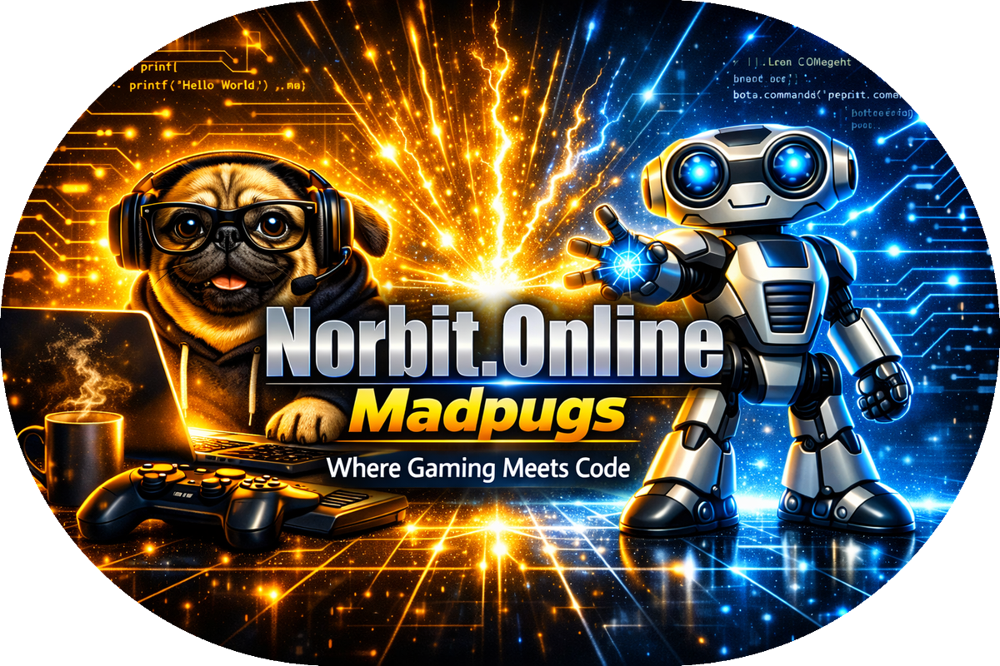

<!-- Banner: madpugs-focus-banner.png (same folder as this README) -->
<!-- GitHub raw URL when published: https://raw.githubusercontent.com/Norbit-Online/MadpugsFocus/main/madpugs-focus-banner.png -->

<div align="center">



</div>

<h1 align="center">Madpugs Focus</h1>

<p align="center">
  <strong>Automatically switch Discord to Do Not Disturb when you're gaming — and back when you're done.</strong>
</p>

<p align="center">
  <a href="https://betterdiscord.app">BetterDiscord</a> ·
  <a href="https://norbit.online">Norbit.Online</a> ·
  <a href="https://github.com/Norbit-Online/MadpugsFocus">GitHub</a>
</p>

<p align="center">
  
  <a href="https://discord.gg/33RDG7HcMm">
    
  </a>
</p>

<p align="center">
  <a href="https://github.com/Norbit-Online/MadpugsFocus/releases/latest/download/MadpugsFocus.plugin.js">
    
  </a>
</p>

<p align="center">
  <a href="https://github.com/Norbit-Online/MadpugsFocus/stargazers"></a>
  <a href="https://github.com/Norbit-Online/MadpugsFocus/network/members"></a>
  <a href="https://github.com/Norbit-Online/MadpugsFocus/releases"></a>
  
</p>

<p align="center">
  
  
</p>

---

## Overview

**Madpugs Focus** is a personal BetterDiscord plugin built by [Madpugs](https://norbit.online) for a gaming-and-work laptop setup. When Discord shows you as **Playing** a game, your status switches to **Do Not Disturb**. When that activity clears, your previous status is restored.

No manual toggling. No missed work pings mid-match. No forgetting to switch back when you close the game.

> *Where Gaming Meets Code.*

---

## Features

| Feature | Description |
|---------|-------------|
| **Auto DND** | Enables Do Not Disturb when Discord detects a playing activity |
| **Auto restore** | Returns you to your previous status (online, idle, etc.) when you stop |
| **Launcher ignore** | Steam, Xbox, GOG, Epic, EA, Ubisoft, Battle.net, Riot — launchers alone won't trigger DND |
| **Exe whitelist** | Optionally limit DND to specific `.exe` files only |
| **Ignored games** | Exclude game titles that should never trigger DND |
| **On-screen toast** | Optional notification when DND activates (max once per minute) |
| **Smart debounce** | Ignores brief activity flicker on quit (overlay shutdown, etc.) |
| **Local only** | No auto-update URL, no external network calls, settings saved locally |

---

## How it works

```
Launch game
    → Discord shows "Playing"
    → ~3 second stability check
    → Status → Do Not Disturb
    → Optional toast notification

Quit game
    → "Playing" clears from Discord
    → ~2 second stability check
    → Status → restored (online / idle / etc.)
    → 30s cooldown prevents overlay shutdown from re-triggering DND
```

The plugin reads Discord's local activity store only. It does not scan your files, send data anywhere, or load remote code.

---

## Prerequisites

- [BetterDiscord](https://betterdiscord.app) installed
- Windows (Discord desktop)

---

## Installation

Click the blue **Download** button at the top of this README (or use the [latest release](https://github.com/Norbit-Online/MadpugsFocus/releases/latest)). That link downloads `MadpugsFocus.plugin.js` and counts toward the download total. **Code → Download ZIP** does not count.

1. Download [`MadpugsFocus.plugin.js`](https://github.com/Norbit-Online/MadpugsFocus/releases/latest/download/MadpugsFocus.plugin.js).
2. In Discord, open **User Settings** → **BetterDiscord** → **Plugins**.
3. Click **Open Plugins Folder**.
4. Place `MadpugsFocus.plugin.js` in that folder.
5. Enable **MadpugsFocus** in the Plugins list.

---

## Settings

Open the plugin settings in BetterDiscord to configure:

### Ignore launchers

Tick platforms whose **launcher/client alone** should not trigger DND. Actual games from those platforms still will.

- Steam · Xbox · GOG Galaxy · Epic Games · EA App · Ubisoft Connect · Battle.net · Riot / League of Legends

> Riot also waits until League of Legends shows **"In Game"** before enabling DND.

### Trigger executables

Leave empty to trigger on **any** detected game. Add specific `.exe` names (e.g. `eldenring.exe`) to only DND for those processes.

Find exact names in **Task Manager → Details** or from Discord's detected game info.

### Ignored games

Add exact game titles (as shown in Discord) that should never trigger DND.

### Notifications

Toggle **"Show on-screen notification when DND is enabled"** — toast appears once, then won't repeat within 1 minute.

---

## Security

This plugin only:

- Reads local game activity from Discord's internal stores
- Updates your Discord status via Discord's own settings API
- Saves plugin settings locally via BetterDiscord `Data.save`

It does **not** make external network requests, load remote scripts, or access files outside Discord.

---

## Troubleshooting

| Problem | Try this |
|---------|----------|
| Stuck on DND after quitting | Disable the plugin once (forces restore), update to latest version, re-enable |
| DND didn't activate | Check ignored launchers / ignored games / exe whitelist settings |
| Status flickers on quit | Normal for games with overlays — v1.6.3+ handles this with debounce + cooldown |
| Multiple toasts | Expected on rapid flicker — limited to one per minute |

---

## License

MIT License — see [LICENSE](LICENSE).

---

<p align="center">
  Built by <a href="https://norbit.online">Norbit.Online</a> · Madpugs
</p>
